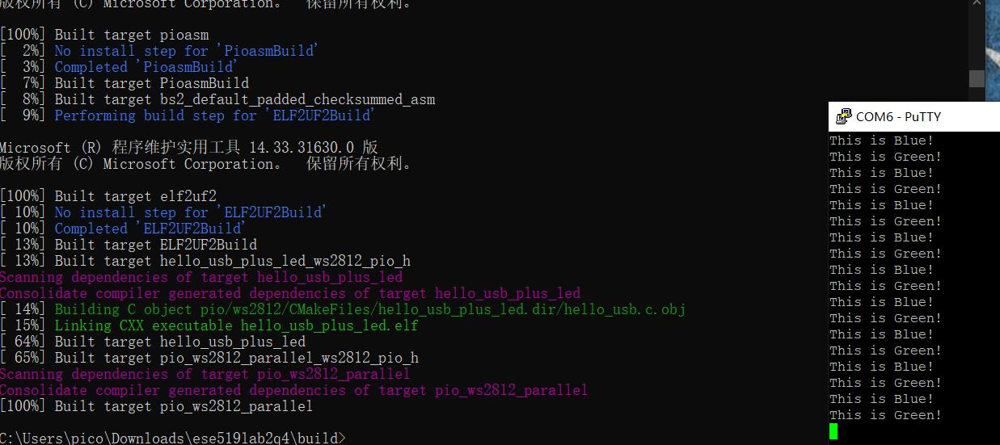

University of Pennsylvania, ESE 5190: Intro to Embedded Systems, Lab 2A

    Yuxuan Li
        liyux@seas.upenn.edu
        [Yuxuan's LinkedIn](https://www.linkedin.com/in/yuxuan-li-26511b203/)
        Worked with: Yuxin Wang, Xinqi Pan
    Tested on:  OMEN Laptop 15-ek0xxx, Windows-10 Intel(R) Core(TM) i7-10750H CPU @ 2.60GHz   2.59 GHz

## Setting Up Terminal

The detailed Set up can be found in the following repo：<https://github.com/Yuxuan-Li295/ese519_lab2_setup>

## Reading questions for 3.2 of the Pico C SDK manual

### Why is bit-bang impractical on our laptop, despite it having a much faster processor than the RP2040 ?

1. For the sake of the speed, modern PC-class processor need to handle with the memory and the speed of the task-process. In bitbanging, the process tries really hard to fit the GPIO reading and writing in same cycle(few microseconds) is diffcult.

2. .The uncertainty of actually entering an interrupt hander the IPQs will become impractical when the speed of the processor above a certain threshold.

### What are some cases where directly using the GPIO might be a better choice than using the PIO hardware?

1. For slower protocols like LED string and simple embeeded system or some brust I/O.
2. In the case that the processor only needs to handle the simple task(does not contain a 'loop' instruction) and the outside of the processor is smaller. For example, LEDs and push buttons(send a signal contains a high voltage to power the WS2812).

### How do you get data into a PIO state machine?
TX FIFO

Set up the PIO state machine to run the loaded program take data from the transmit FIFO buffer and place it in the output shift register(OSR), once the state machine is running, interact with it. The data will transmit in the speed of one word (32-bit chunks) at a time. PULL and OUT instructions can be used. 

### How do you get data out of a PIO state machine?
Data is shifted to ISR and then to RX FIFO. This process passes on the data to the system. PUSH and IN instructions are used.

### How do you program a PIO state machine?

PICO ASM

1. Got some software (C++ SDK or MicroPython) to Sets up a PIO state machine to run the program.
2. Write with the nine instructions of the PIO, PIO state machine execute short, binary programs for common interfaces such as UART, SPI, or I2C(available in the PIO library). Determine which PIO instance to use.
3. Assign instructions into instruction memory with sufficient space and find an availabel state machine.
4. Got the cmake file which describes how these PIO grogram and the softare can interact with each other and combine them into a executable file to the RP2040-based development-board.

### In the example, which low-level C SDK function is directly responsible for telling the PIO to set the LED to a new color? How is this function accessed from the main “application” code?

`pio_sm_put_blocking(pio,sm,1)`  (Parses a PIO source file and outputs the assembed version)  

The low-level C SDK function is a helper function that used to block the FIFO queue if it is full and responsible to set the LED into new color, the data are pushed into the state machine's TX FIFO.
To access the function, the correct headers should be included firstly, then in the running process, the assembler will link the corresponding file, LED being turend on and off when writing 1 and 0 respectively.

### What role does the pioasm “assembler” play in the example, and how does this interact with CMake?

The pre-bootstrapped pioasm ‘assembler' will translate the assembly code(input text file) into the binary file consists with '0' and '1' that our machine could understand. It can also be used to generate prgorams suitable for using with the MicroPython PIO libray. The CMake function `Pico_generate_pio_header(TARDETPIO_FiLE)` will invoking the pioasmand automatically adding the corresponding healder to include path of the target. Therefore, we do not have to invoke pioasm in the SDK directly.
# 3.3 
Go through the ws2812 code. The count in the code jumps from 'ws2812.c' at line 6 to 'ws2812.h' and jumps back at 20. The annotated and numbereed code is given as follows:  
PDF File [Annotation for 3.3](https://github.com/Yuxuan-Li295/ese5190-2022-lab2-into-the-void-star/blob/main/3.3_Code_Annotation.pdf) 

Decision:  
Open up the '.c' and '.pio.h' files and go over it in line by line manner and make decision about whether to step into the instrction and if it comes from the '.h' file we will step to follow the flow.

# 3.4

Data can be acuquired using the printing values method with the code given as follows:

The value in the register for sequential address is then given as follows:

The detailed PDF is given as follows:  

3.4 Table [COLOR BY NUMBER](https://github.com/Yuxuan-Li295/ese5190-2022-lab2-into-the-void-star/blob/main/3.4_Register_List.pdf) 

# 3.5
There are 10 SM clock cycles for 1 bit color data written into the FIFO. For 24 bits, there's total 240 cycles. But because the configuration is set to send 'RGBW' value, so we will send total 320 cycles.  

T1 = 2, T2 =5, T3 = 3

l1 is an out instruction .out takes some bits from the output shift register(OSR) and writes them somewhere else.  
 [T3-1] is responisble calculating number of delay cycles.  

Side 0: (Drive Low(0))-the pin configured for side-set
x denotes the destination of the write data  

sdie 1 on the side-set pin
The flow for the required drawing is given as follows:

The above diagram would start when data ready at the TX FIFO and ends when the first bit sent to the GPIO pin to WS2812. In our drawing, different bits(0 or 1) is being considered. 

A limitation of the drawing is the time dealy here could not be depicted very precise, which may affect the control of the clock. Since the time required to transmit a signal is 1.25us while it is also the time period for ws2812 to receive a signal.
The drawing timing diagram can also not help us to determine whether there i a IRQ for micrcontroller from the peripheral or not. 

---

**Data flow:**
 (TX FIFO -> SM-> OSR)
`SHIFTCTRL_OUT_SHIFTDIR=0`, so OSR shift **left**
> **Autopull**: a mode where the state machine automatically
refills the OSR from the TX FIFO (an automatic pull) when a configured number of bits have been shifted out. 
> **Stalling**: 
• A WAIT instruction’s condition is not yet met 
• A blocking PULL when the TX FIFO is empty, or a blocking PUSH when the RX FIFO is full 
• An IRQ WAIT instruction which has set an IRQ flag, and is waiting for it to clear 
• An OUT instruction when autopull is enabled, and OSR has already reached its shift threshold 
• An IN instruction when autopush is enabled, ISR reaches its shift threshold, and the RX FIFO is full

  # 3.6 Zooming in
  In 3.5, the time period depicted is one state machine clock, which has relateively low precision(there may be not enough dealy for the signals. BUt details could become visible when we zoom into a much trivial region time period like 1/2 or 1/8 time period. The detailed zooming in is given as the following pdf(shows sending the whole color package):  

  3.6 Table [Zooming in](https://github.com/Yuxuan-Li295/ese5190-2022-lab2-into-the-void-star/blob/main/3.6_Zoom_In.pdf) 

The voltage for the emitting color for WS2812'S LED and the data transfer time for T0H T1H...T0L T1L and RES are given in the following graph:

# 3.7 Timing Diagram 
General sequence:  
FIFO->SM->WS2812->APDS-9960  

Refer to the following link [3.7](https://github.com/Yuxuan-Li295/ese5190-2022-lab2-into-the-void-star/blob/main/3.6_Zoom_In.pdf) and the below timing diagram:

# Tools Comparison  

- What were some strengths/weaknesses of working with paper?
	- Have more space and easier for drawing the diagram but is hard to adjust the width and length of the timing diagram. Moreover, Analysis of the C code and the .pio.h file while understanding the flow of each instruction is easier through annotating on paper. 
  - Another drawback is the large number of sheets need to refer to. 

- What were some strengths/weaknesses of working with spreadsheets?
	- Spreadsheets help in better organisation of data and make it easier to read which is one of the main strenghts. Easy to copy and paste for other use while the disadvantage is that the spreadsheet is not that straightforward compared with the diagram. 
	- A drawback of the spreadsheets is the overwhelming data information. 
- How might you approach this task using other tools available to you?
   - Timing diagram geneartor or python to write some script file. 
   - SDK documentation is usually a good resource for you to refer to.
   - Make good use of avaialable IDE to simplify the code time. 
  
# Part 4 USB + WS2812
WS2812 receives the color data in the 'GRB' order instead from the normal 'RGB' order. It would take the first 24 bit of the data from the PIO state machine and ignrore the following 8 digits in the whole 32 bit package.   

The corresponding code for this part is contained in the folder: 'Part4_Final'. 

The process is concluded as follows:
1. Creating a new test folder outside the pico-examples folder.
2. Copying documents from pico-examples folder.
3. Modifying CMakelists files.
4. Modifying WS2812 code and the given RP2040 example hello_usb.
5. Building a new folder inside the test folder.
6. Running the new .uf2 file.  
   
After the building process, copy-past the generated '.uf2' file on the microcontroller and the following effect can be examined:

## Modifying WS2812 code.

1. Changing the pin from 2 to 12. The connection betwen WS2812 and the RP2040 is wire connection. The input of the WS2812 is the DI pin, which corresponding to 'PIN 12' on Adafruit Qt Py 2040, the process of setting pin is useful for let the output of the side se tin the PIO0, the data could be transferred through side set insructions. The GPIO will then get involved and handle with the power pin for WS2812. 
  
2. Adding the following 

as a new init() function to initialize the ws2812 program.

3. Create a new function called set_neopixel_color which transfer the r,g,b color into g,r,b format by shifting(bitwise shift) the corresponding usigned 32 bit int.

The LED can successfully blinking synchronously with the corresponding output information displayed:

# Part 4 Appendix

## Raspberry Pi Pico SDK Examples

The [Getting Started with the Raspberry Pi Pico](https://rptl.io/pico-get-started) is found to be useful for getting things up and running on my local machine.

### First  Examples

App|Description | Link to prebuilt UF2
---|---|---
[hello_usb](hello_world/usb) | The obligatory Hello World program for Pico (Output over USB version) | https://rptl.io/pico-hello-usb

### Pico Board

App|Description
---|---
[blinky](picoboard/blinky)| Blink "hello, world" in Morse code on Pico's LED
[button](picoboard/button)| Use Pico's BOOTSEL button as a regular button input, by temporarily suspending flash access.

### Decisions I made while working with the modeling documents

1. For 3.3---annotated codes

    I decided to go over basic instructions by browsing the relevant SDK library. Getting to know the meaning of the low-level instructions like pio_sm_put_blocking.
    
2. For 3.4---PIO Registers

    Looking throught the code and the RP2040 manual and determine each register's status to learn about the PIO's working manner.
    
3. For 3.6 & 3.7 --- Timing diagram
   
    Based on previous part, figure on the value for the 32-bit register after the affect of these instructions.

## Feedback
The sample spreadsheet or more detailed and clear instructions would be helpful for section 3.6 and 3.7 in this lab and I learned a lot in this lab with the help of JunPeng Zhao and Qi Xue.

