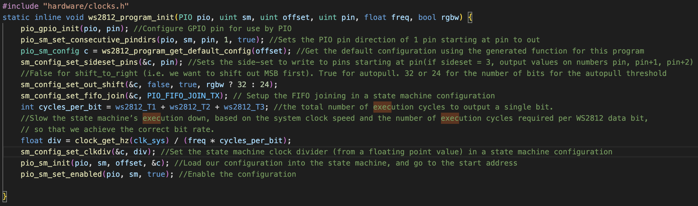
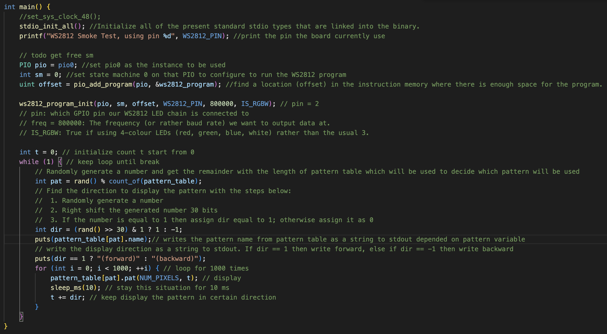
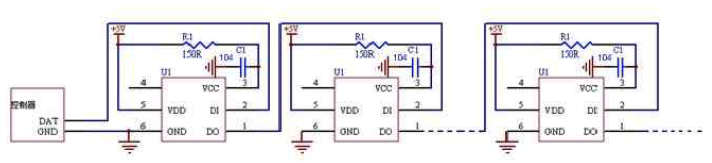
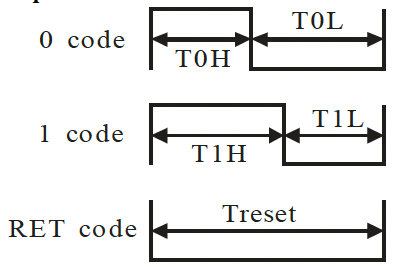
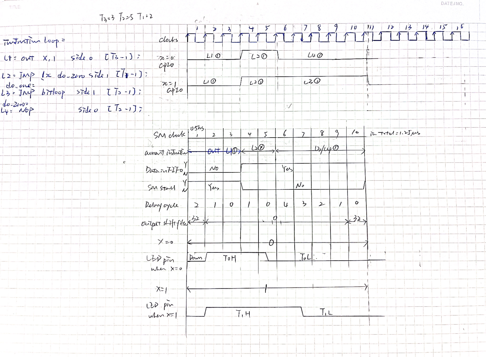

University of Pennsylvania, ESE 5190: Intro to Embedded Systems, Lab 2A

    Xingqi Pan
         LinkedIn: https://www.linkedin.com/in/xingqipan
    Tested on: MacBook Pro (14-inch, 2021), macOS Monterey 12.5.1

## PART 3: TALKING LEDS
In this part, we aims to get familiar with how the data flows from user to LEDs. The program is coded in C and compiled via CMake.

### Part 3.1 Resources
Here is the list of resources and references we used in this lab:
- RP2040
  - RP2040 Datasheet
  - Pico SDK Datasheet
  - Pico C/C++ SDK
  - Pico C/C++ SDK Example
- WS2812
  - WS2812 Datasheet
- Fictitious APDS-9960 photodiode
  - APDS-9960 Datasheet

### Part 3.2 PIO
- **Why is bit-banging impractical on your laptop, despite it having a much faster processor than the RP2040?**
    - As laptop processors have become faster in terms of overwhelming number-crunching brute force, the layers of software and hardware between the processor and the outside world have also grown in number and size. In response to the growing distance between processors and memory, PC-class processors keep many hundreds of instructions in-flight on a single core at once, which has drawbacks when trying to switch rapidly between hard real-time tasks. 
- **What are some cases where directly using the GPIO might be a better choice than using the PIO hardware?**
    - As the cost of using the PIO hardware is very high as the PIO hardware present a very unfamiliar programming model to those well-versed in embedded software.
- **How do you get data into a PIO state machine?**
    - The pio_sm_put_blocking() function uses ‘push’ instruction data into RX FIFO and ‘in’ instruction to transit one data item to it.
- **How do you get data out of a PIO state machine?**
    - Using ‘pull’ instruction to take data from TX FIFO buffer, and ‘out’ instruction to take one data item from TX FIFO.
- **How do you program a PIO state machine?**
    - Write a PIO program with PIO assembly language.
- **In the example, which low-level C SDK function is directly responsible for telling the PIO to set the LED to a new color? How is this function accessed from the main “application” code?**
    - pio_sm_put_blocking(pio0, 0, pixel_grb << 8u).
    - Include ‘ws2812.pio.h’ document and using ‘put_pixel’ method to input color data.
- **What role does the pioasm “assembler” play in the example, and how does this interact with CMake?**
    - The PIO assembler. This program processes a PIO assembly input text file, which may contain multiple programs, and writes out the assembled programs ready for use.

### Part 3.3 FOLLOW THE FLOW
In this chapter, we use two example codes given in pico-example((pico-examples/pio/ws2812/)) to understand the data flow:
- ws2812.c
- generated/ws2812.pio.h 

The graphs below shows the annotations I made for my interpretation of how the whole process work.

### Part 3.4 COLOR BY NUMBER
Some questions are answered below and [3.4.xlsx](https://github.com/anniepan8215/ese5190-2022-lab2-into-the-void-star/blob/main/Part3/3.4/PIO%20Lisf%20of%20Registers.xlsx) shows our results of registers tracking.
- **Which PIO instance is being used?**
    - PIO 0
- **Which state machine is being used with this PIO instance?**
    - State machine 0
- **Which pin is this state machine configured to control? (you can either use settings from the example program or for the Qt Py LED pin yours will be connected to)**
    - 2
- **8How long is this state machine’s clock cycle?**
    - 125MHz = 8ns
- **How much is this state machine’s clock scaled-down relative to the system clock? (i.e. the “clock divisor”)**
    - 15.625
- **In which direction will this state machine shift bits out of its “output shift register”?**
    - Take the MSB and shift left.
- Which TxFn is used for sending and RxFn used for receiving?
  - From the pio.h, TxF0 is used for sending and RxF0 used for receiving.

### Part 3.5 MODELING TIME
In this part, we want to follow up the state machine's states and operations relays to a color packet to the NeoPixel.
#### Part 3.5.1 WS2812 protocal
- **What basic circuitry does a WS2812 LED need to operate?**
  - 
  - Control circuit and RGB chip, signal reshaping circuit, electric reset circuit and power lost reset circuit.
- **How do you connect a WS2812 to a microcontroller?**
    - WS2812: DIN port receives data from the controller
    - RP2040: GPIO port 12 sends data to WS2812
- **How does a WS2812 translate bits to color values?**
    - the first pixel collects initial 24bit data and is then sent to the internal data latch, the other data reshaped by the internal signal reshaping amplification circuit is sent to the next cascade pixel through the DO port. After transmission for each pixel, the signal to reduce by 24bit.
- **How do you send a single 1 or 0 bit to the WS2812?**
  - 
  - T0H:0.35us; T1H:0.7us; T0L:0.8us; T1L:0.6us.
- **How many bits does it take to send a single color value?**
    - 24 bits for all three colors, 8 for each.
- **What happens if you send more bits than this in a packet?**
    - Keep the first three bytes and pass the remaining data to the output port.
- **How do you tell a WS2812 you’re done sending data?**
    - Sending reset code for at least 50us.
- **How do you send data to more than one WS2812 in a chain?**
  - Send data serially. WS2812 will catch up first three bytes and pass the reminder to the WS2812.

#### Part 3.5.2 Time flow chart

### Part 3.6&3.7 ZOOMING IN with TIMING DIAGRAM
In this section, we zoom in the time flow(clock cycle/2) to catch up the data flow. 
Please check file [3.6&3.7.xlsx](https://github.com/anniepan8215/ese5190-2022-lab2-into-the-void-star/blob/main/Part3/3.6%263.7/3.6%263.7.xlsx) for more details.

## PART 4: HELLO, BLINKENLIGHT
Here we design an interactable program in C which allow user to control the color of the LED located on WS2812 with certain key. See code in folder [Part 4](https://github.com/anniepan8215/ese5190-2022-lab2-into-the-void-star/tree/main/lab2a_part4).
Some manipulation instruction:
- See 'Hello world' to confirm connection between RP2040 and PC.
- Button for light control:
  - 'w' or 'W': White
  - 'b' or 'B': Blue
  - 'g' or 'G': Green
  - 'r' or 'R': Red
  - 'p' or 'P': Purple
  - 'c' or 'C': Cyan
  - 'y' or 'Y': Yellow

