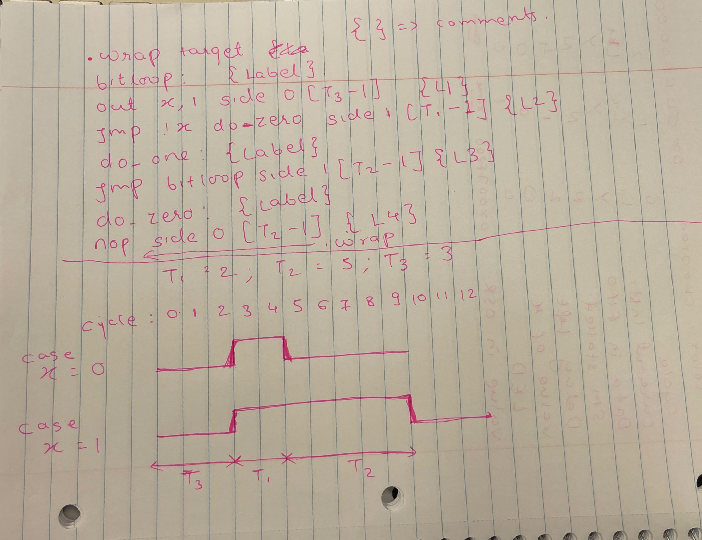
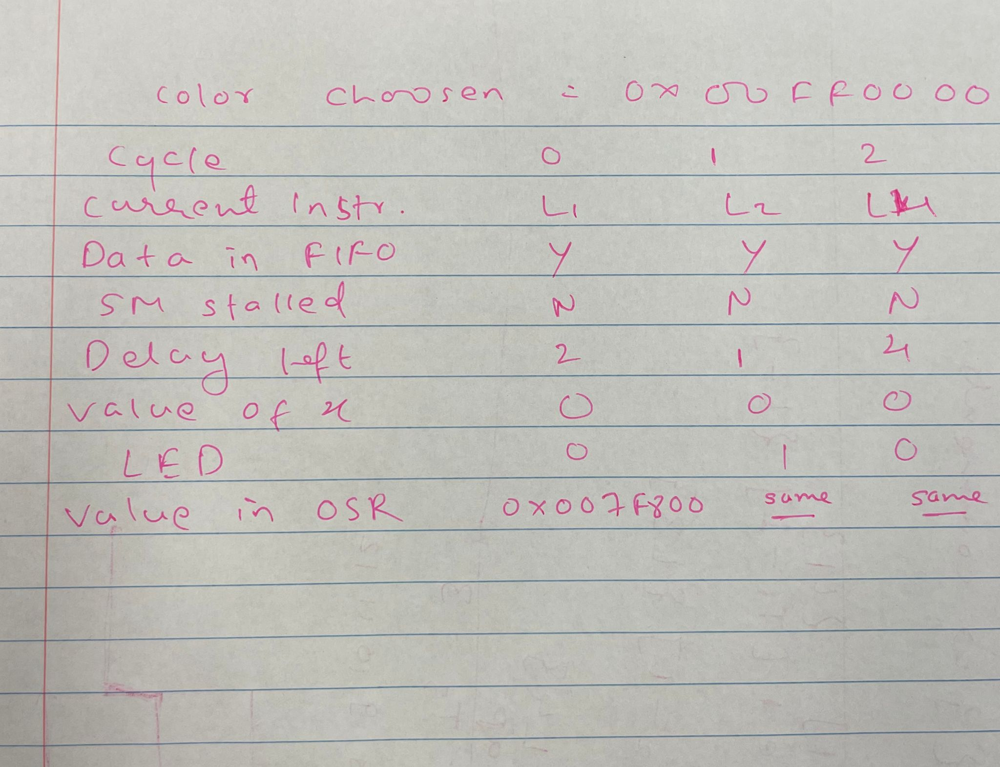
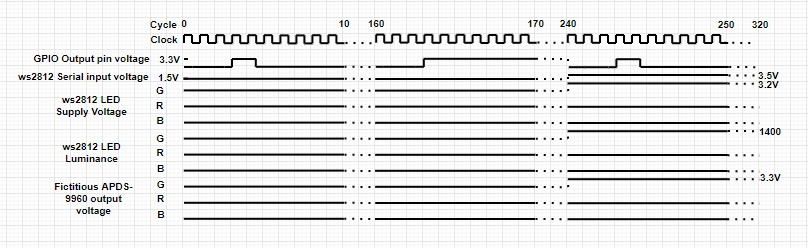

University of Pennsylvania, ESE 5190: Intro to Embedded Systems, Lab 2A

    Yash Budhe worked with Sahil Mangaonkar and Akshaya Nidhi Bhati 
        LinkedIn: https://www.linkedin.com/in/yash-mb-a1723812b
    Tested on: HP Envy x360 Convertible, 11th Gen Intel(R) Core(TM) i7-1165G7 @ 2.80GHz 

# 3.2 PIO

The questions given in the section 3.2 are answered in the following file - "Answers to Qs in 3.2.pdf". The source for information and learning are RP2040 Datasheet and Raspberry Pi Pico C/C++ SDK manual. 

Link - https://github.com/yash-mb/ese5190-2022-lab2-into-the-void-star/blob/8c79a5e3339b28333234f7ff783bbc1e88a8266b/Answers%20to%20Qs%20in%203.2.pdf

# 3.3 Code Annotations

The codes in ws2812 folder of pico-examples has been annotated and numbered according to instructions given - details can be found in "Lab2_assign.pdf" page 19. For better visualization and flow the annotations are done in microsoft ppt and can be accessed in "Code Annotations.pptx".

Link - https://github.com/yash-mb/ese5190-2022-lab2-into-the-void-star/blob/8c79a5e3339b28333234f7ff783bbc1e88a8266b/Code%20annotation.pptx

# 3.4 Registers

We have selected Pi0 as base and value of registers is found using the RP2040 datasheet.

Link - https://github.com/yash-mb/ese5190-2022-lab2-into-the-void-star/blob/6939f813a4b906ff0e74e16c7b73f252bca62d65/Q3.4%20-%20Registers.xlsx

1.	Which PIO instance is being used? 

Ans: Pio0

2.	Which state machine is being used with this PIO instance?

Ans: SM0

3.	Which pin is this state machine configured to control? (you can  either use settings from the example program, or for the Qt Py  LED pin yours will be connected to)  

Ans: Default pin of mcu or pin 2 of mcu

4.	How long is this state machine’s clock cycle? 

Ans: 0.8MHz

5.	How much is this state machine’s clock scaled down relative to the system clock? (i.e. the “clock divisor”)  

Ans: 16.625

6.	In which direction will this state machine shift bits out of its  “output shift register”?

Ans: LSB first (right shift)

# 3.5 Modeling Time

The color we have choosed is green - 0x00FF0000. The process flow of one bit into the instruction code is show. The timing diagram is shown for both the cases of x {0 and 1}. But the table is shown for case when x=0 as our input's first bit will be zero.

1.	What basic circuitry does a WS2812 LED need to operate? 

Ans: Supply (GND and VDD=5v), data pin, a resistor of value 150, a capacitor.

2.	How do you connect a WS2812 to a microcontroller? 

Ans: Connect GND of microcontroller to GND of WS2812, a gpio pin of microcontroller controlled using PIO to data in (DI) pin of ws2812.

3.	How does a WS2812 translate bits to color values? 

Ans: Bits are sent sequentially to the module to turn on and off the led so fast that we can see a color generated as we wanted.

4.	How do you send a single 1 or 0 bit to the WS2812? 

Ans: Make DI pin high or low using data pin of microcontroller.

5.	How many bits does it take to send a single color value? 

Ans: 8

6.	What happens if you send more bits than this in a packet? 

Ans: It will take data as it comes and will not give correct color.

7.	How do you tell a WS2812 you’re done sending data? 

Ans: Out instruction waits for data and keep side pin low.

8.	How do you send data to more than one WS2812 in a chain?

Ans: Connect DO of 1 module to DI of other and so on.

# 3.6 Zooming In:

This is a complex process. Every bit of the color input takes 10 cycles, thus 24 bits will take 240 cycles and after that only the microcontroller will know that green signal is expected. The details can be found in the spreadsheet:

https://github.com/yash-mb/ese5190-2022-lab2-into-the-void-star/blob/67f1007e0927a6a07d0ddb5ab72c1bfaa1de1d28/Q3.6.xlsx

# 3.7 Timing Diagram

Point to be noted here is that the changes in any values are not instantaneous.

This gives an overview of the spreadsheet intriduced in part 3.6.

# 4. Hello Blinkenlight

Welcome to our project. We have leveraged the pico-examples - hello_usb.c and ws2812.c, merging them together to work as a single coherent program. You can find all the required files in the "Q4" folder. It's recommended that you download the folder and refer to the setup guide to build the program. Copy-paste the .uf2 file on microcontroller and witness the magic!

## What's happening here?

Depending upon which key is pressed, the program blinks the corresponding color in the LED. Here, we have choosen the keys - 4,5, and 6 which blinks red, green, and blue. The program starts with a message "Enter any number". You need to press the number key and then press enter. After blinking followed by a little pause, it resets and asks for another number.

This can be visualized in the following:

# At the end of your writeup of section 3, reflect on the tools you used for modeling from a user interface design perspective.

## What were some strengths/weaknesses of working with paper?

Strengths: Flexibility in representation	

Weaknesses: time consuming and making changes is difficult

## What were some strengths/weaknesses of working with spreadsheets?

Strengths: much cleaner than paper model and saves time		

Weaknesses: Regid way of representation (only tabular)

## How might you approach this task using other tools available to you?

Ans: Flowchart can also be used to show the flow of the code

