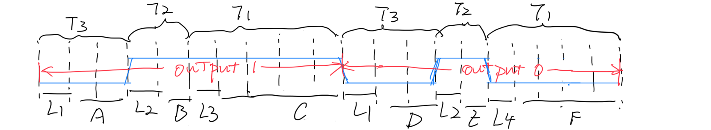
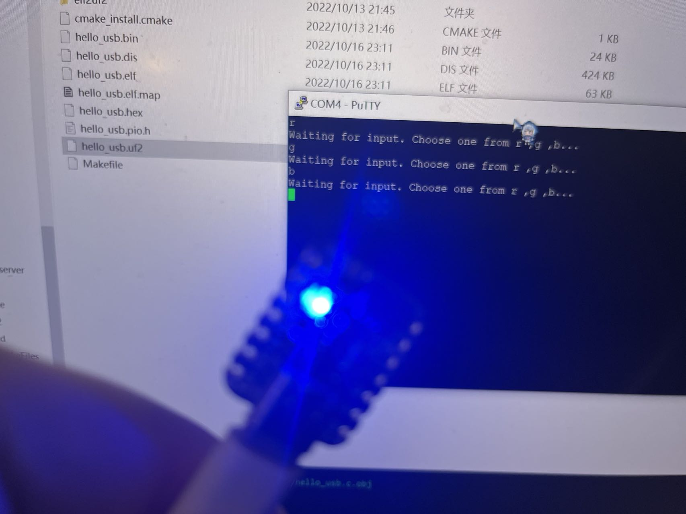

University of Pennsylvania, ESE 5190: Intro to Embedded Systems, Lab 2A

    Qiwen Luo
        https://www.linkedin.com/in/qiwen-luo-33a058226/
    Tested on: 
    	ROG Zephyrus M16
    	Intel Core i7-11800H
    	16GB RAM
    	Windows 10 21H2
    	WSL2: Ubuntu 20.04.5 LTS

# Introduction

This is for the Lab2 of ESE 5190, in which we are getting start with programming by PICO SDK, and trying to understand the lower level work flow in RP2040 behind the high level C programming.

# 3.3 Annotated Code

The annotated code is attach to this repo. [ws2812.pdf](ws2812.pdf) 

# 3.4 Spreadsheet of initial PIO register states

The spreadsheet is also attach to this repo ([Registors.xlsx](Registors.xlsx)). The details will be described in 3.4.3.

## 3.4.1 Overview of PIO module

From the [rp2040 datasheet](https://datasheets.raspberrypi.com/rp2040/rp2040-datasheet.pdf), we find some of structures in chapter 3 PIO, these may be useful for the understanding of work flow. In the example of ws2812, we are just doing the output, which means we can only check for the output registers.

**Overview of PIO**


**Overview of state machine**


**Output Shift Register (OSR)**


## 3.4.2 Questions

To begin, we first answer the following questions:

- Which PIO instance is being used? 

  - 

    from the code we can see that pio0 is been used

- Which state machine is being used with this PIO instance?

  - state machine 0 is been used

- Which pin is this state machine configured to control? (you can either use settings from the example program, or for the Qt Py LED pin yours will be connected to)

  - For the Qt Py, the configuration is included in SDK. We can find the setting in the configuration file. 

    ```
    pico-sdk/src/boards/include/boards/adafruit_qtpy_rp2040.h
    ```

    

    Here we can know that Qt Py does not have a build-in LED, but a NEOPIXEL (ws2812). And the output pin should be 12. And we should pay attention that there is a power pin for NEOPIXEL, which is 11, which we may be used in the following work.

- How long is this state machine’s clock cycle?

  - 

    

    From ws2812.pio.h we can know that, the numbers of cycle that for state machine to output a bit is equal to
    
    2+5+3=10
    

- How much is this state machine’s clock scaled down relative to the system clock? (i.e. the “clock divisor”) 

  - 

    

    

    And then we can calculate 
    
    div=(125x10^{6})/(800000x10)=15.625
    

- In which direction will this state machine shift bits out of its “output shift register”?

  - 

    False means shift OSR to left.

## 3.4.3 Find the Value of Registers

The important thing is that, we should find the value when PIO SM (state machine) is waiting for data at the beginning of its main loop (“stalled”). 

The complete spreadsheet is also attach to this repo ([Registors.xlsx](Registors.xlsx)).

For the registers of state machine, we have know that we are using pio0 and sm0.


These value can be find in the initialization of PIO, which is written in ws2812.pio.h.


And for the instruction memory registers, it seem that the instruction will be occupied from the 32nd register, which is 'INSTR_MEM31'. We have print the offset, it shows that the offset is 28. And the PIO has 4 instruction, which means they are be placed from 28 to 31.


The we can take a look at other parts, the registers of PIO and FIFOs


# 3.5 Paper Model

## 3.5.1 Working Principle of WS2812

Most of information can be find on [WS2812 datasheet](https://cdn-shop.adafruit.com/datasheets/WS2812.pdf)

- What basic circuitry does a WS2812 LED need to operate?

  - 

    

    

    

    A voltage supply, a ground connected, a power supply control circuit, and a data signal input.

- How do you connect a WS2812 to a microcontroller?

  - It's shown in the picture above. DOUT is not required.

- How does a WS2812 translate bits to color values?

  - 

    Receive 24 bits of data, of which G, R, B occupies 8 bits each

    And then according to the power supply control circuit to get the output

    

- How do you send a single 1 or 0 bit to the WS2812?

  - 

    

    We can see that, use 3 different pulses represent for 0, 1 and reset as input.

- How many bits does it take to send a single color value?

  - 24 bits.

- What happens if you send more bits than this in a packet?

  - It will only read the first 24 bits for the output. And then the additional bits will be treated as the representation of next color.

- How do you tell a WS2812 you’re done sending data?

  - Keep the data signal at low for more than 50us

- How do you send data to more than one WS2812 in a chain?

  - 

    Connect the DOUT of one to DIN of the next.

## 3.5.2 Main Loop of SM

First we label the instructions as below:


Then the main loop should be


## 3.5.3 Step Through the System State

We suppose that we are driving our LED to GREEN, where the data in FIFO should be. And now we considering about we are experiencing the process of sending the 8th bit and 9th bit, and the next color is red.

GREEN

```
0xff000000
or
1111 1111 0000 0000 0000 0000 0000 0000
```

RED

```
0x00ff0000
or
0000 0000 1111 1111 0000 0000 0000 0000
```

And now we considering about we are experiencing the process of sending the 8th bit and 9th bit, where is is bolded

1111 111**1 0**000 0000 0000 0000 0000 0000 0000 0000 1111 1111 0000 0000 0000 0000

The output should be going are below:



And the state is shown in the form ([state.xlsx](state.xlsx)):


We can clearly seen from the diagram and form that, each bit need 10 clock cycle to create a custom wave for transmission. Thus, 


# 3.6&3.7 Zoom in and Timing Diagram

Now let's stretch the time to 4 bits. Suppose that we are first sending blue and then green and then a random color and focus on the point that finish the blue transmission. In this case, we can see more changes in different component. 

0000 0000 0000 0000 1111 11**11 00**00 0000 

1111 1111 0000 0000 0000 0000 0000 0000 

1010 1000 1010 1110 0010 1011 0000 0000

The observed bits is bolded as shown. The first 32 bits are blue bits, and then the following 32 bits are the green bits, and the next 32 bits are still green.

And the timing diagram is shown below ( [zoomin.xlsx](zoomin.xlsx) )


# 4. HELLO, BLINKENLIGHT

## 4.1 Introduction

The project for Lab2A is in the folder 'Lab02'.

This project design a system that read from the USB console and give the corresponding output for red, green or blue.

And most of code is based on [PICO example of ws2812](https://github.com/raspberrypi/pico-examples/tree/master/pio/ws2812).




## 4.2 Features

Include keyboard input for the NEOPIXEL control on adafruit Qt Py RP2040.

```c
while (true) {
        sleep_ms(1000);
        printf("Waiting for input. Choose one from r ,g ,b...\n");
        while(true){
            int c = getchar_timeout_us(100);
            if (c != PICO_ERROR_TIMEOUT) {
                // 114 is ASCII for 'r'
                if (c == 114) {
                    putchar_raw(c);
                    printf("\n");
                    set_neopixel_color(0xff0000);
                    break;
                }
                // 103 is ASCII for 'g'
                else if (c == 103) {
                    putchar_raw(c);
                    printf("\n");
                    set_neopixel_color(0x00ff00);
                    break;
                }
                // 98 is ASCII for 'b'
                else if (c == 98) {
                    putchar_raw(c);
                    printf("\n");
                    set_neopixel_color(0x0000ff);
                    break;
                }
                else {
                    printf("error input!\n");
                }
            } 
        }
    }
```

Include color data breakdown function for reorder

```c
uint32_t r_32 = (color & 0xff0000) >> 16u;
uint32_t g_32 = (color & 0x00ff00) >> 8u;
uint32_t b_32 = (color & 0x0000ff);
```

