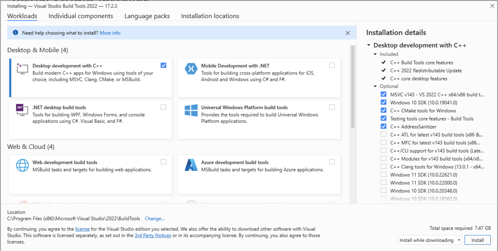
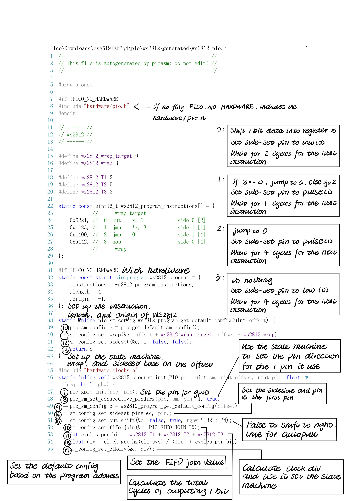

University of Pennsylvania, ESE 5190: Intro to Embedded Systems, Lab 2A

    Qi Xue
        qixue@seas.upenn.edu
    Tested on: Alienware x15 R1, Windows 11 Home, 11th Gen Intel(R) Core(TM) i7-11800H
    
    # ese5190-2022-lab2-2A

## Part II - Setup

### 1. Machine details

Details | My PC
:---: | :---:
Device | Alienware x15 R1
OS| Windows 11 Home
Processor | 11th Gen Intel(R) Core(TM) i7-11800H @2.3GHz
System | 64-bit operating system, x64-based processor


### 2. Toolchain

To install the toolchain to build, follow the tutorial of **9.2. Building on MS Windows** in [Getting-started-with-pico.pdf](https://datasheets.raspberrypi.com/pico/getting-started-with-pico.pdf).  
Besides, download **the Visual Studio 2022** from the Microsoft Store if needed.

#### 2.1 Download Executable Installers
Tools | State
:---: | :---:
[Arm GNU](https://developer.arm.com/tools-and-software/open-source-software/developer-tools/gnu-toolchain/downloads) | Need to download
[CMake](https://cmake.org/download/) | Need to download
[Build Tools for Visual Studio 2022](https://visualstudio.microsoft.com/downloads/#build-tools-for-visual-studio-2022) | Need to download
[Python 3.10](https://www.python.org/downloads/windows/) | Already exist
[Git](https://git-scm.com/download/win) | Already exist

#### 2.2 Installing
##### 2.2.1 Installing Arm GNU Toolchain
1. Run the GNU executable installer.  
2. Tick the box `Show Readme`.
3. Tick the box `Launch gccvar.bat`.
4. Tick the box `Add path to environmnet variable`.
5. Tick the box `Add registry information`.
6. Choose to install GNU on `C:\`.  


##### 2.2.2 Installing CMake
1. Run the CMake executable installer.  
2. Tick the circle `Add CMake to the system PATH for all users`.


##### 2.2.3 Installing Build Tools for Visual Studio 2022
1. Run the Build Tools executable installer.  
2. Tick the box `Desktop development with C++`.
3. Remember install the C++ build tools only.


### 3. Getthing the SDK and examples

Create a log for the examples. For me, I created the log in my **C:\Users\xue_q\Downloads** instead of the **C:\Users\xue_q\Document**. This is because my **Document** folder linked to my **OneDrive**, which has a defualt language of Chinese and I do not quite sure how to change that[^1]. 

Open the **Terminal** app on PC and run as follows:

```
C:\Users\xue_q\Downloads\lab2> git clone -b master https://github.com/raspberrypi/pico-sdk.git
C:\Users\xue_q\Downloads\lab2> cd pico-sdk
C:\Users\xue_q\Downloads\lab2\pico-sdk> git submodule update --init
C:\Users\xue_q\Downloads\lab2\pico-sdk> cd ..
C:\Users\xue_q\Downloads\lab2> git clone -b master https://github.com/raspberrypi/pico-examples.git
```

### 4. Building "Hello World" from the Command Line

#### 4.1 Set the Path to the SDK
Open the **Developer Command Prompt for VS 2022** by searching for it in the Windows search box and set the path to the SDK as follow[2]:

```
C:\Users\xue_q\Downloads\lab2> setx PICO_SDK_PATH "C:\Users\xue_q\Downloads\lab2\pico-sdk" 
```

#### 4.2 Set the Environment Variables
Then, close the current **Developer Command Prompt** window and open a second **Developer Command Prompt** window and set the environment variables as follows:

```
C:\Users\xue_q\Downloads\lab2> cd pico-examples
C:\Users\xue_q\Downloads\lab2\pico-examples> mkdir build
C:\Users\xue_q\Downloads\lab2\pico-examples> cd build
C:\Users\xue_q\Downloads\lab2\pico-examples\build> cmake -G "NMake Makefiles" ..
C:\Users\xue_q\Downloads\lab2\pico-examples\build> nmake
```

The command line should look like this if build successfully:


### 5. Run "Hello World" on the RP2040

#### 5.1 Plug in RP2040 and Check Ports
1. Plug only RP2040 using a micro-USB cable in without the sensor, hold down the `BOOTSEL` button to force it into USB Mass Storage Mode. 
2. Open **Device Manager** by searching for it in the Windows search box.
3. **Important:** Check the port hte RP2040 uses. In my case, it is COM6, which is differnet from the port RP2040 used during Lab1[3]:


#### 5.2 Run "Hello World"
Copy the C:\Users\xue_q\Downloads\lab2\pico-examples\build\hello_world\usb\hello-usb.uf2 file and paste it to the RP2040.  
Then, open the serial console and the code is running as follow:


### 6. Quirks and Tips
[1]: If the path of your build directory contains characters that CMake cannot recognize, such as Chinese characters, `cmake` in the following steps will fail. Thus, make sure no such characters involving the log.

[2]: Make sure the path is the absolute path, or it might cause problems when using CMake in part 4.

[3]: I first directly used my saved puTTy configuration and the serial console cannot connected to the device successfully. I did not know that the port occupied by the same external drive can change so I wasted some time on this. Thus, double check the port before open the serial console.

## PartIII - Talking LED

### 3.2 PIO

Read Chapter 3 in the Pico C SDK manual, and try to understand how
the PIO module is used to communicate with a WS2812 module in the
example. Some questions to guide your reading:

#### Why is bit-banging impractical on your laptop, despite it having a much faster processor than the RP2040?
- The number of instruction that a laptop needs to process is way larger than RP2040, and the instruction handling process is more conplex as well. Although it have a much faster preocessor than RP2040, it is not worthy to use bit-banging.

#### are some cases where directly using the GPIO might be a better choice than using the PIO hardware?
- Simple embedded system to run program with relativeliy long cycle per bit and with small simple tasks needed to handle such as LEDs.

#### How do you get data into a PIO state machine?
- Use TX FIFO to get data into a PIO state machine.

#### How do you get data out of a PIO state machine?
- Use RX FIFO to get data out of a PIO state machine.

#### How do you program a PIO state machine?
- Use PIO ASM to program a PIO state machine.

#### In the example, which low-level C SDK function is directly responsible for telling the PIO to set the LED to a new color? How is this function accessed from the main "application" code?
- `pio_sm_put_blocking` function in `put_pixel` function.
- When main call a pattern function which will call `put_pixel` inside, `pio_sm_put_blocking` will be called and set the LED to a new color based on the input.

#### What role does the pioasm "assembler" play in the example, and how does this interact with CMake?
- The PIO ASM assembler encoded the the PIO files into assembly language which can be understand by RP2040.
- CMake tell the assembler how to bundle up the files and generated the header file.

### 3.3 Follow the Flow





### 3.4 Color by Number
My favorite color is <font color=#C8A2C8>**lalic**</font>, with a RGB code <font color=#C8A2C8>**#C8A2C8**</font>, and the 24 bit binary number as expected by the NeoPixel, which is GRB, is <font color=#C8A2C8>**0xA2C8C8**</font>.


### 3.5 Modeling Time


### 3.6 Zooming In


### 3.7 Timing Diagram


### Reflection
#### Modeling Documents
- The instructor suggested we used paper and pen, but I decided to use my ipad to do the work that needed to be done on paper. I am not prefer to carry paper and pen with me since I always forgot where I put them. My ipad is quite new, so I do not need to recharge it very ofter. I also used the spreadsheets as the isntructor suggested since markdown support those kind of tools.

#### What were some strengths/weaknesses of working with paper?
- Strengths: Paper and pen do not need electricity to support their funcitons, so I can work with them at any time and place.

- Weaknessed: It is hard to organize papers, and they are easy be losed.

#### What were some strengths/weaknesses of working with spreadsheets?
- Strengths: Spreadsheets have a straightforward user-interface so it is easy to use when analyzing data.

- Weaknessed: Spreadsheets require user to input data manually, so it is time-consuming when dealing with huge data.

#### How might you approach this task using other tools?
- I might use python or other script languages instead of using spreadsheets if the data invovling in the lab is huge.

## PartIV - Hello, Blinkenlight

The LED successfully brinking sychronously with print-out information: when green light shows, it outputs "Green!" on the serial port; when blue light shows, it outputs "Blue!" on the serial port.

See code for detail.