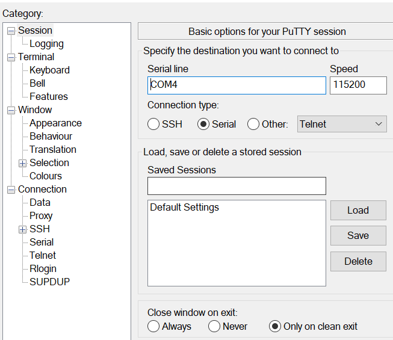
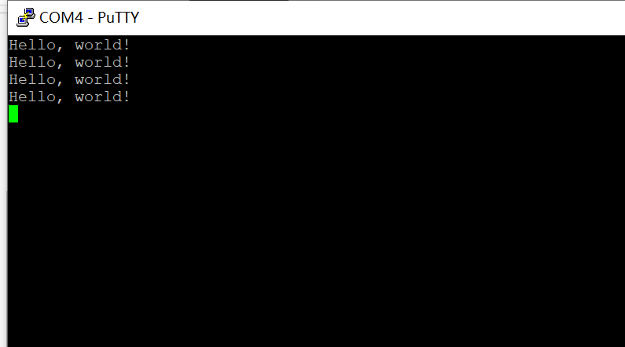
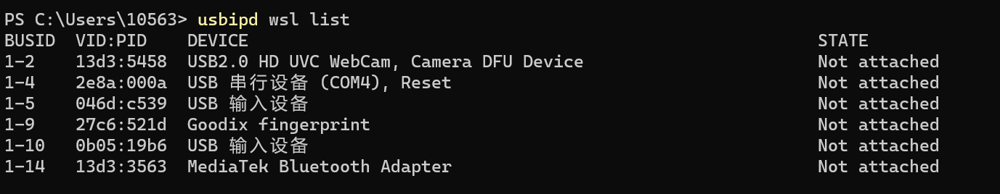
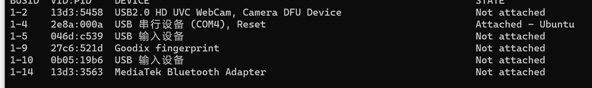
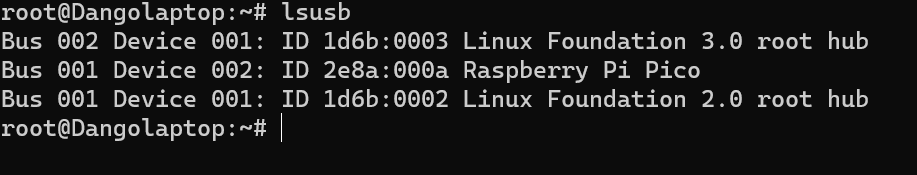
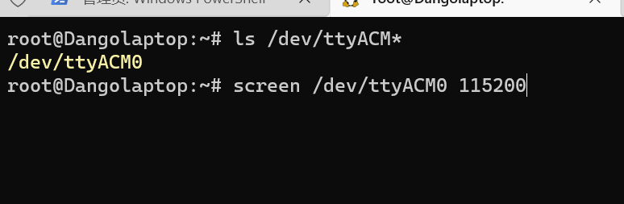
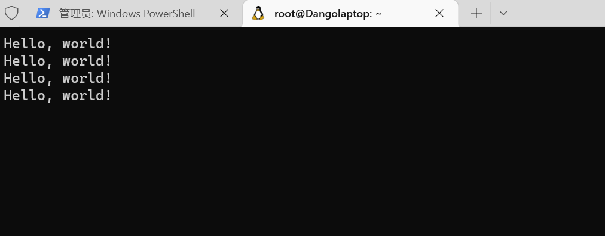

# Platform

```
ROG Zephyrus M16, Windows 10 21H2
	11th Gen Intel(R) Core(TM) i7-11800H @ 2.30GHz  16-core
	NVIDIA GeForce RTX 3060 Laptop GPU
Adafruit QT Py RP2040
```

Basically I'm using WSL2, which is supported on windows10 or higher.


# Serial Console

### Windows

Download the latest version of putty

[Download PuTTY: latest release (0.77) (greenend.org.uk)](https://www.chiark.greenend.org.uk/~sgtatham/putty/latest.html)

Before setting the putty we need to find QTPY in the device manager. Here in my computer the board is denoted as 'COM4'


Then we can go to putty and make the setting as shown. Baud rate will be set to 115200 as default. 



Click 'Open', then we can have a window successfully connected to the serial console.




### WSL

You can also just connect the board to your WSL2 through the solution provided by Microsoft. And importantly, you need to be running a WSL 2.(https://devblogs.microsoft.com/commandline/connecting-usb-devices-to-wsl/)

On your ubuntu, you should run these for installing the user space tools for USB/IP and a database of USB hardware identifiers.

```
sudo apt install linux-tools-5.4.0-77-generic hwdata
sudo update-alternatives --install /usr/local/bin/usbip usbip /usr/lib/linux-tools/5.4.0-77-generic/usbip 20
```

And then we can just run the *administrator* PowerShell

```
usbipd wsl list
```

Then we can find the device that attach to this computer



Here we can find that our board has BUSID of '1-4'. Then we can use command for attaching and detaching the board to our WSL.

```
usbipd wsl attach --busid <1-4>
usbipd wsl detach --busid <1-4>
```

If we check the list again we can find the board is attached, at the same time we can hear the sound from windows which inform you there is a device disconnecting.



Go to our ubuntu terminal, we can use the command to check the connection.

```
lsusb
```



And now we can use 'screen' for the serial console.

```
ls /dev/ttyACM*
screen /dev/ttyACM0 115200
```






# SDK install

[Pico C/C++ Development Using Windows (pimoroni.com)](https://learn.pimoroni.com/article/pico-development-using-wsl)

First install the software that the Pico SDK needs to be able to compile and build files

```
git cmake gcc-arm-none-eabi libnewlib-arm-none-eabi build-essential libstdc++-arm-none-eabi-newlib
```

clone the SDK

```
git clone -b master https://github.com/raspberrypi/pico-sdk.git --recursive
```

clone the examples

```
git clone -b master https://github.com/raspberrypi/pico-examples.git
```


# Build file

Path define is important

```
export PICO_SDK_PATH=../../pico-sdk
```

Then follow the instructions and we can build the examples.

```
cd ~/pico/pico-examples
mkdir build
cd build
```

Here we should notice that we are not using Raspberry Pi Pico. Then we should set the configuration for our board Adafruit QT Py RP2040,  which is include in the SDK

```
cmake .. -D"PICO_BOARD=adafruit_qtpy_rp2040"
```

And its ok to use '-j16' for our 16-core CPU

```
make -j16
```

Finally, its easy to open the explorer on windows, and drag uf2 files to our board

```
explorer.exe .
```


